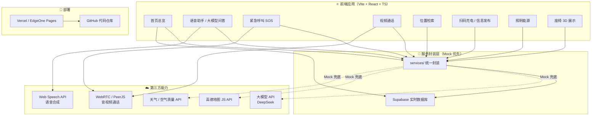

# 智能助老座椅 · Web Demo 技术方案

> **本文档范围：代码组职责** —— 可运行 Web Demo + GitHub 代码仓库 + 部署上线
> 产品设计（建模 / 外观 / 原型）由设计组负责，见文末「接口约定」。

---

## 〇、职责边界（先说清楚）

### ✅ 我们负责（代码组）

| 项 | 交付物 | 形式 |
|----|--------|------|
| 1 | **可运行 Web Demo** | 在线体验地址 |
| 2 | **GitHub 代码仓库** | 公开仓库链接 |
| 3 | **README**（项目说明 + 架构图 + 截图/GIF + 运行指南） | 仓库文件 |
| 4 | **部署上线** | HTTPS 在线地址 |
| 5 | 代码演示部分的录屏素材 | 视频片段 |
| 6 | 可选：PWA 安装包 | Release 附件 |

### ❌ 我们不负责（设计组 / 其他组）

- 3D 建模、三视图、爆炸图、尺寸标注图、渲染图
- 外观造型、材质色板、色彩方案
- Figma / 即时设计高保真原型
- 商业模式、答辩 PPT 整体统筹、隐私合规文档定稿

### 🔌 需要设计组提供的「接口物料」

| 物料 | 用途 | 期望格式 | 到位时间 |
|------|------|----------|----------|
| **3D 模型文件** | Demo 内 360° 旋转展示 | `.glb` / `.gltf`（建议 < 5MB） | D6 前 |
| **设计规范** | 前端主题（配色 / 字号 / 圆角） | 色值、字号表（Figma 标注即可） | D5 前 |
| **渲染图 / 三视图** | 放进 Demo 页面 + README 配图 | PNG（建议 1920px 宽） | D7 前 |
| **原型分享链接** | 放进 README 佐证 | URL | D5 前 |
| **功能文案** | 各页面文字内容 | 纯文本 | D6 前 |

> ⚠️ **风险提示**：如果设计物料延期，代码组**先用占位素材开发**（灰色方块、假数据），物料到位后替换，**不阻塞开发进度**。

---

## 一、交付目标与成熟度

| 等级 | 含义 | 本项目 |
|------|------|--------|
| L1 | 设计稿 | 设计组负责 |
| L2 | 可点击原型 | 设计组负责 |
| **L3** | **可运行 Demo + 在线地址** | **✅ 代码组负责** |

**代码组的目标**：拿出一个**能打开、能点、能演示、不翻车**的 Web Demo，配一个**结构清晰、README 专业**的 GitHub 仓库。

---

## 二、总体技术架构



### 三个核心架构决策

#### ① 纯前端 + BaaS，不自建后端
用 **Supabase** 承担实时数据（座位状态、多杆联动、信息发布），省掉服务器搭建与运维。

#### ② Mock 优先 —— 保证演示永不失败 ⭐
所有外部能力统一走 `services/` 封装层，**默认走假数据**，配了 Key 才走真实 API：

```
正常 → 调真实 API
没 Key / 限流 / 报错 / 断网 → 自动降级为 Mock
```

#### ③ 占位优先 —— 不被设计物料阻塞
所有图片、模型、文案都通过**配置文件集中管理**，物料没到位就用占位资源，到位后一处替换。

---

## 三、技术选型

| 层次 | 技术 | 选型理由 |
|------|------|----------|
| 构建 | **Vite** 6.x | 秒级启动，构建快 |
| 框架 | **React 19 + TypeScript** | 生态成熟，组件化 |
| UI 库 | **Ant Design 5** | 开箱即用，易做适老化大字号改造 |
| 路由 | React Router 7 | SPA 多页面 |
| 状态 | Zustand | 轻量，上手快 |
| 实时数据 | **Supabase** | 实时订阅 + 免费额度 + 免后端 |
| 3D | Three.js + @react-three/fiber | 展示设计组提供的 `.glb` |
| 语音 | **Web Speech API** | 浏览器原生，零成本 |
| 大模型 | **DeepSeek API** | 便宜、中文强、OpenAI 兼容 |
| 地图 | 高德地图 JS API 2.0 | 国内 POI 数据最全 |
| 通话 | PeerJS (WebRTC) | 免自建信令服务器 |
| 图表 | Ant Design Charts | 能源/环境数据可视化 |
| 部署 | Vercel / EdgeOne Pages | 一条命令上线 |

---

## 四、功能模块与实现方案

### 4.1 P0 —— 必须做成可运行

| 模块 | 实现方式 | 依赖物料 |
|------|----------|----------|
| **首页总览** | AntD Grid 卡片 + 状态 | 无 |
| **座椅 3D 展示** | Three.js 加载 `.glb`，支持旋转缩放 | 设计组模型 |
| **语音播报** | `speechSynthesis`，语速 0.9 | 无 |
| **大模型问答** | DeepSeek API + 语音播报 | API Key |
| **紧急呼叫 SOS** | 状态机动画：待机→呼叫→接通→安抚 | 无 |
| **视频通话** | PeerJS 房间号配对 | 无 |
| **位置检索** | 高德 JS API + Mock POI 兜底 | API Key |
| **信息发布** | Supabase 实时同步（后台改→屏端显） | 无 |
| **座位状态 / 多杆联动** | Supabase Realtime，多窗口演示 | 无 |

### 4.2 P1 —— 模拟实现即可

| 模块 | 做法 |
|------|------|
| SOS 物理键 | 按钮按压动画 + 流程图说明 |
| 久坐 / 坐姿提醒 | 前端计时器 → 弹窗提醒 |
| 扫码充电 | 二维码 → 电量动画（假数据） |
| AED / 灭火弹舱 | 开舱动效 UI + 状态面板 |
| 自动报警 | 模拟「事件 → 弹窗 / 短信」流程 |
| 环境监测 | 调免费天气 API，失败走 Mock |
| 自适应调光 | 滑块模拟「光照 → 亮度」 |
| 隐私授权 | 授权页面原型 + 数据流向图 |

### 4.3 P2 —— 不写代码，只在 README / 架构图里说明

跌倒检测 · 异常行为识别 · 非接触心率呼吸 · 雷达视觉融合 · 共享充电宝/雨伞 · WiFi/5G · 座椅加热通风 · 驱蚊

---

## 五、页面结构与路由

| 路由 | 页面 | 参数示例 | 优先级 |
|------|------|----------|--------|
| `/` | 首页总览大屏 | - | P0 |
| `/structure` | 座椅 3D 展示 | - | P0 |
| `/assistant` | 语音助手 + 大模型问答 | - | P0 |
| `/sos` | 紧急呼叫 | - | P0 |
| `/call` | 视频通话 | `?room=xxx` | P0 |
| `/map` | 位置检索 | - | P0 |
| `/notice` | 信息发布 | - | P0 |
| `/energy` | 照明能源 | - | P0/P1 |
| `/charge` | 扫码充电（模拟） | - | P1 |
| `/health` | 健康关怀（模拟） | - | P1 |
| `/admin` | 管理后台 | - | P1 |

> 💡 **多杆联动演示技巧**：用 URL 参数区分灯杆
> `?pole=pole-01` 和 `?pole=pole-02` 开两个窗口，座位状态实时互通。

---

## 六、工程目录结构

```
smart-bench/
├─ public/
│  ├─ models/              # 设计组提供的 .glb（占位：placeholder.glb）
│  ├─ images/              # 渲染图、三视图（占位：placeholder.png）
│  └─ favicon.ico
├─ src/
│  ├─ components/          # 通用组件
│  │  ├─ Layout/
│  │  ├─ BigButton/        # 适老化大按钮
│  │  ├─ StatusCard/
│  │  └─ Placeholder/      # ⭐ 物料占位组件
│  ├─ pages/               # 页面
│  ├─ services/            # ⭐ 服务封装层（Mock 优先）
│  │  ├─ llm.ts
│  │  ├─ tts.ts
│  │  ├─ map.ts
│  │  ├─ call.ts
│  │  ├─ realtime.ts
│  │  └─ weather.ts
│  ├─ config/              # ⭐ 集中配置
│  │  ├─ theme.ts          # 设计规范（配色/字号）
│  │  └─ assets.ts         # 图片/模型路径集中管理
│  ├─ hooks/
│  ├─ store/
│  ├─ mock/
│  ├─ router/
│  ├─ styles/
│  ├─ App.tsx
│  └─ main.tsx
├─ docs/
│  ├─ TECH_PLAN.md         # 本文件
│  └─ GIT_WORKFLOW.md      # 团队协作规范
├─ .env.local              # 密钥（不进仓库）
├─ .env.example            # 密钥模板
├─ .gitignore
├─ package.json
└─ README.md
```

---

## 七、接口与环境变量设计

### 7.1 环境变量模板（`.env.example`）

```bash
# 全局 Mock 开关（true = 全用假数据，演示永不失败）
VITE_USE_MOCK=true

# 大模型
VITE_LLM_PROVIDER=deepseek
VITE_LLM_API_KEY=
VITE_LLM_BASE_URL=https://api.deepseek.com

# 高德地图
VITE_AMAP_KEY=

# Supabase
VITE_SUPABASE_URL=
VITE_SUPABASE_ANON_KEY=
```

### 7.2 Mock 优先封装范式

```ts
// src/services/llm.ts
export async function askLLM(question: string): Promise<string> {
  const useMock = import.meta.env.VITE_USE_MOCK === 'true'
  const key = import.meta.env.VITE_LLM_API_KEY

  if (useMock || !key) return mockAnswer(question)   // ← 兜底 1：没配 Key

  try {
    const res = await fetch(`${import.meta.env.VITE_LLM_BASE_URL}/chat/completions`, {
      method: 'POST',
      headers: { 'Content-Type': 'application/json', Authorization: `Bearer ${key}` },
      body: JSON.stringify({
        model: 'deepseek-chat',
        messages: [{ role: 'user', content: question }],
      }),
    })
    if (!res.ok) throw new Error(String(res.status))
    const data = await res.json()
    return data.choices[0].message.content
  } catch {
    return mockAnswer(question)                       // ← 兜底 2：请求出错
  }
}
```

### 7.3 实时数据表（Supabase）

```sql
-- 座位状态（多杆联动核心）
create table seats (
  id         bigint primary key generated always as identity,
  pole_id    text not null,          -- 灯杆编号，如 'pole-01'
  seat_no    int  not null,
  occupied   boolean default false,
  updated_at timestamptz default now()
);

-- 信息发布
create table notices (
  id         bigint primary key generated always as identity,
  title      text not null,
  content    text not null,
  published  boolean default false,
  created_at timestamptz default now()
);
```

---

## 八、关键技术要点

### 8.1 语音播报（零依赖）
```ts
export function speak(text: string) {
  const u = new SpeechSynthesisUtterance(text)
  u.lang = 'zh-CN'
  u.rate = 0.9        // 适老化：放慢语速
  u.volume = 1
  window.speechSynthesis.speak(u)
}
```

### 8.2 紧急呼叫状态机
```
待机 → 按下SOS → 呼叫中(动画+提示音) → 已接通(模拟) → 语音安抚 → 结束
          ↓ 3 秒无响应
      自动升级 → 弹窗 + 模拟外呼
```

### 8.3 多杆联动（多窗口演示）
- 窗口 A 开 `?pole=pole-01`，窗口 B 开 `?pole=pole-02`
- 两端都订阅 Supabase `seats` 表
- A 点「有人坐下」→ B 的座位状态**实时变化**

### 8.4 适老化 UI 规范（前端落实到 CSS）
| 项目 | 规范 |
|------|------|
| 字号 | 正文 ≥ 20px，标题 ≥ 32px |
| 按钮 | 高度 ≥ 64px，大圆角，强对比 |
| 配色 | 高对比度（等设计组规范到位后替换为品牌色） |
| 交互 | 大热区、少层级、语音 + 文字双通道 |

---

## 九、排期（代码组部分）

| 天 | 任务 | 产出 |
|----|------|------|
| **D5** | 搭 Vite + React 脚手架；路由、布局、适老化主题；**首次 push** | 可运行骨架 |
| **D6** | 首页总览 + 3D 展示 + 占位素材接入 | 2 个页面 |
| **D7** | 语音播报 + 大模型问答 + 紧急呼叫 SOS | P0 功能 |
| **D8** | 地图检索 + 视频通话 + 多杆联动 + 充电模拟 + 信息发布 | P0/P1 功能 |
| **D9** | 部署上线；完善 README（架构图 + 截图 + GIF）；物料替换为设计组成品 | 在线地址 |
| **D10** | 录制代码演示片段；配合答辩 | 视频素材 |

> ⏰ **时间预留**：D9 要留出**物料替换 + 部署踩坑**的时间，别把功能压到 D10。

---

## 十、Git 协作规范 ⭐（代码组组长必读）

### 10.1 分支策略
```
main      ← 稳定版，只用于演示和部署（保护分支，不直接推）
  └─ dev  ← 集成分支，功能合并到这里测试
       └─ feature/xxx  ← 每人一个功能分支
```

### 10.2 日常流程
```bash
# 1. 从 dev 拉一个新功能分支
git checkout dev && git pull
git checkout -b feature/voice-assistant

# 2. 开发，边写边提交
git add .
git commit -m "feat: 实现语音播报与语速调节"

# 3. 推上去
git push -u origin feature/voice-assistant

# 4. 到 GitHub 发起 Pull Request（目标分支选 dev）
# 5. 队友 Review 后合并
```

### 10.3 Commit 信息规范
| 前缀 | 含义 | 示例 |
|------|------|------|
| `feat` | 新功能 | `feat: 新增紧急呼叫状态机` |
| `fix` | 修 Bug | `fix: 修复地图加载失败` |
| `docs` | 文档 | `docs: 补充技术方案` |
| `style` | 样式 | `style: 调整适老化字号` |
| `refactor` | 重构 | `refactor: 抽离服务封装层` |
| `chore` | 杂务 | `chore: 更新依赖` |

### 10.4 团队铁律
1. 🔒 **`.env.local` 绝不提交**（已在 `.gitignore`）
2. 🚫 **不直接推 `main`**，全部走 PR
3. 🔄 **每天至少 push 一次**，避免代码只存在你电脑里
4. 📝 **提交信息写清楚**，队友能看懂你改了什么
5. 🧩 **一个人一个分支**，避免互相覆盖

---

## 十一、部署方案

| 方案 | 优点 | 缺点 | 建议 |
|------|------|------|------|
| **Vercel** | 最简单，连 GitHub 自动部署 | 国内访问偶尔慢 | ✅ 主用 |
| **EdgeOne Pages**（腾讯云） | 国内快 | 需注册 | ✅ **备用（双保险）** |
| Gitee Pages | 国内快 | 需实名 + 审核 | 备选 |
| GitHub Pages | 免费 | 国内慢 | 不推荐主用 |

> 🎯 **双部署策略**：主地址挂了，立刻切备用地址，**答辩现场绝不被动**。

**连 GitHub 自动部署的流程**：推代码到 `main` → Vercel 自动构建 → 生成在线地址。之后每次 push 都会自动更新。

---

## 十二、风险与降级预案

| 风险 | 预案 |
|------|------|
| 大模型 API 限流/欠费 | Mock 兜底，预置 20 条常见老人问答 |
| 高德 Key 未申请/超额 | 降级为「静态地图图 + POI 列表」 |
| WebRTC 打不通（NAT） | 提前录好**通话录屏**，现场放视频 |
| Supabase 额度用尽 | 降级为同浏览器 `BroadcastChannel` |
| **设计物料延期** | **占位素材照常开发**，D9 统一替换 |
| 部署平台被墙/慢 | Vercel + EdgeOne **双部署** |
| 时间不够 | 严格按 **P0 → P1 → P2** 砍，P0 保底 |

---

## 十三、交付清单（代码组）

- [ ] 可运行 Web Demo（在线地址）
- [ ] GitHub 公开仓库（含 README + 架构图 + 截图/GIF）
- [ ] README 含：项目简介、技术栈、**运行指南**、架构图、功能截图
- [ ] `.env.example` 密钥模板（**不含真实密钥**）
- [ ] 部署双地址（Vercel + 国内平台）
- [ ] 代码演示录屏素材
- [ ] 可选：PWA 安装包（Release 附件）

---

## 十四、立即可做的准备（不写代码）

- [ ] **申请 DeepSeek API Key**（大模型问答）
- [ ] **注册 Supabase 免费项目**（多杆联动）
- [ ] **申请高德地图 JS API Key**（位置检索）
- [ ] **找设计组要**：3D 模型 `.glb`、设计规范、渲染图、原型链接
- [ ] **建团队协作**：把队友加为仓库 Collaborator，约定分支规范

---

*文档版本：v2.0（聚焦代码组职责）｜ 更新见仓库提交记录*
