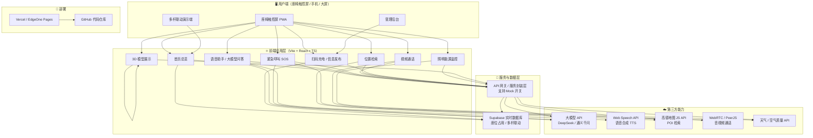

# 智能助老座椅 · 技术方案（10 天可交付版）

> 目标：10 天内产出**可信、可验证、可演示**的佐证材料。
> 核心策略：**已有建模产出 + Figma 高保真原型 + 可运行 Web Demo** 三件套。

---

## 一、项目定位与交付目标

### 1.1 一句话定位
面向老年群体的**智慧公共座椅 / 智慧灯杆**，集适老化结构、紧急救助、健康关怀、便民服务、照明能源于一体。

### 1.2 成熟度佐证分级

| 等级 | 含义 | 交付形式 | 本项目覆盖 |
|------|------|----------|-----------|
| **L1** | 设计稿 | 三视图、爆炸图、渲染图、设计说明书 | ✅ 基于已有建模导出 |
| **L2** | 可点击原型 | Figma / 即时设计分享链接 | ✅ 覆盖 6 条主流程 |
| **L3** | 可运行 Demo | 在线体验地址 + 代码仓库 | ✅ 本方案重点 |

> ❌ **不做**：真实传感器算法、医疗器械合规、线下运营、实物硬件集成。

---

## 二、总体技术架构



### 架构要点
1. **纯前端 + BaaS**：不写自建后端，用 Supabase 承担实时数据，降低 10 天内的开发与运维成本。
2. **Mock 优先**：所有第三方能力（大模型、地图、通话）都封装在 `services/` 层，**默认走 Mock 数据**，有 Key 时切真实 API —— 保证演示永不失败。
3. **多杆联动靠实时数据库**：开两个浏览器窗口 = 两根灯杆，实时同步座位状态。

---

## 三、技术选型

| 层次 | 技术 | 版本 | 选型理由 |
|------|------|------|----------|
| 构建工具 | **Vite** | 6.x | 秒级启动，生态成熟 |
| 框架 | **React + TypeScript** | 19 / 5.x | 组件化，类型安全，资料多 |
| UI 组件库 | **Ant Design** | 5.x | 大屏 / 表单 / 弹窗开箱即用，适合适老化大字号改造 |
| 路由 | React Router | 7.x | SPA 多页面切换 |
| 状态管理 | Zustand | 5.x | 轻量，比 Redux 简单 |
| 实时数据 | **Supabase** | - | 实时订阅 + 免费额度 + 免后端 |
| 3D 展示 | Three.js + @react-three/fiber | - | 在线 360° 查看已有模型 |
| 语音播报 | **Web Speech API** | 浏览器原生 | 零成本，无需联网 |
| 大模型问答 | **DeepSeek API** | - | 便宜、中文强、OpenAI 兼容 |
| 地图检索 | 高德地图 JS API | 2.0 | 国内 POI 数据最全 |
| 音视频通话 | PeerJS (WebRTC) | - | 免自建信令服务器 |
| 图表 | Ant Design Charts | - | 能源 / 环境数据可视化 |
| 部署 | Vercel 或 EdgeOne Pages | - | 一条命令上线，自动 HTTPS |

---

## 四、功能模块拆解与实现方案

### 4.1 P0 —— 必须做（可运行）

| 模块 | 子功能 | 实现方式 | 交付物 |
|------|--------|----------|--------|
| **首页总览** | 大屏状态、功能入口 | React + AntD Grid | 页面 |
| **座椅结构** | 三视图 / 爆炸图 / 360° | 已有模型导出图片 + Three.js 旋转 | 图片 + 页面 |
| **适老设计** | 尺寸对比表、材质色板 | 静态页面 + 表格 | 页面 |
| **语音播报** | 文字转语音 | `window.speechSynthesis` | 功能 |
| **大模型问答** | 老人提问 → AI 回答 | DeepSeek API + 语音播报 | 功能 |
| **紧急呼叫** | SOS → 呼叫 → 接通 → 安抚 | 状态机动画 + 语音 + 弹窗 | 功能 + 时序图 |
| **视频通话** | 双端实时通话 | PeerJS（房间号配对） | 功能 |
| **位置检索** | 附近医院 / 公交 | 高德 JS API + Mock POI 兜底 | 功能 |
| **信息发布** | 后台编辑 → 屏端展示 | Supabase 实时同步 | 功能 |
| **照明能源** | 夜景效果、亮度分区 | 图片 + 滑块模拟调光 | 页面 |
| **座位状态** | 占用 / 空闲实时显示 | Supabase Realtime，多窗口联动 | 功能 |

### 4.2 P1 —— 降级做（原型 / 模拟）

| 模块 | 实现方式 | 降级说明 |
|------|----------|----------|
| SOS 物理键 | 结构位置设计稿 + 按压动画 | 不做真实电路 |
| 久坐 / 坐姿提醒 | 前端计时器模拟 → 弹提醒 | 不做真实传感器 |
| 扫码充电 | 二维码 → 电量动画模拟页 | 不接真实硬件 |
| AED / 灭火弹舱 | 爆炸图 + 开舱动效 UI | 不做真实装载 |
| 自动报警 | 模拟「事件 → 弹窗 / 短信」流程 | 不接真实 110/120 |
| 太阳能 / 储能 | 能源流向图 + 容量估算表 | 不做实物 |
| 环境监测 | 调免费天气 / 空气质量 API | 不做真实传感器 |
| 自适应调光 | 滑块模拟「光照 → 亮度」 | 不做真实传感 |
| 授权共享 | 隐私授权页面原型 + 数据流向图 | 仅设计 |

### 4.3 P2 —— 暂缓（只写二期规划）

跌倒检测 · 异常行为识别 · 非接触心率呼吸 · 雷达视觉融合 · 共享充电宝 / 雨伞 · WiFi / 5G 组网 · 座椅加热通风 · 驱蚊

> 处理方式：写入「二期规划」与「技术架构图」，**不制作可运行佐证**。

---

## 五、页面结构与路由

| 路由 | 页面 | 关键能力 | 优先级 |
|------|------|----------|--------|
| `/` | 首页总览大屏 | 状态卡片、功能入口、多杆状态 | P0 |
| `/structure` | 座椅结构展示 | 三视图 / 爆炸图 / 360° 旋转 | P0 |
| `/elderly` | 适老化设计 | 尺寸对比、材质色板 | P0 |
| `/assistant` | 语音助手 | 语音播报 + 大模型问答 | P0 |
| `/sos` | 紧急呼叫 | SOS 流程动画 + 语音安抚 | P0 |
| `/call` | 视频通话 | PeerJS 双端通话 | P0 |
| `/map` | 位置检索 | 高德地图 + POI 列表 | P0 |
| `/charge` | 扫码充电 | 二维码 + 电量动画（模拟） | P1 |
| `/notice` | 信息发布 | 内容编辑 + 屏端展示 | P0 |
| `/energy` | 照明能源 | 夜景图 + 调光滑块 | P0/P1 |
| `/health` | 健康关怀 | 坐姿提醒模拟、授权页 | P1 |
| `/admin` | 管理后台 | 信息发布管理、数据看板 | P1 |

---

## 六、工程目录结构

```
smart-bench/
├─ public/
│  ├─ models/              # 3D 模型文件（glb）
│  ├─ images/              # 三视图、爆炸图、渲染图
│  └─ favicon.ico
├─ src/
│  ├─ assets/              # 静态资源
│  ├─ components/          # 通用组件
│  │  ├─ Layout/
│  │  ├─ BigButton/        # 适老化大按钮
│  │  └─ StatusCard/
│  ├─ pages/               # 页面（对应路由）
│  │  ├─ Home/
│  │  ├─ Structure/
│  │  ├─ Assistant/
│  │  ├─ Sos/
│  │  ├─ Call/
│  │  ├─ Map/
│  │  ├─ Charge/
│  │  ├─ Notice/
│  │  ├─ Energy/
│  │  └─ Admin/
│  ├─ services/            # ⭐ 服务封装层
│  │  ├─ llm.ts            # 大模型（含 Mock）
│  │  ├─ tts.ts            # 语音播报
│  │  ├─ map.ts            # 高德地图（含 Mock）
│  │  ├─ call.ts           # PeerJS 通话
│  │  ├─ realtime.ts       # Supabase 实时
│  │  └─ weather.ts        # 天气 / 空气质量
│  ├─ hooks/               # 自定义 hooks
│  ├─ store/               # Zustand 状态
│  ├─ mock/                # 模拟数据
│  ├─ router/              # 路由配置
│  ├─ styles/              # 全局样式（适老化主题）
│  ├─ App.tsx
│  └─ main.tsx
├─ docs/                   # 文档
│  ├─ TECH_PLAN.md         # 本文件
│  ├─ ARCHITECTURE.md      # 架构图说明
│  └─ PRIVACY.md           # 隐私与数据授权说明
├─ .env.local              # 密钥（不进仓库！）
├─ .env.example            # 密钥模板（进仓库）
├─ .gitignore
├─ package.json
└─ README.md
```

---

## 七、数据与接口设计

### 7.1 环境变量（`.env.example` 模板）

```bash
# 大模型
VITE_LLM_PROVIDER=deepseek
VITE_LLM_API_KEY=
VITE_LLM_BASE_URL=https://api.deepseek.com

# 高德地图
VITE_AMAP_KEY=

# Supabase 实时数据库
VITE_SUPABASE_URL=
VITE_SUPABASE_ANON_KEY=

# 全局 Mock 开关（true = 用假数据，演示永不失败）
VITE_USE_MOCK=true
```

> 🔒 **安全铁律**：`.env.local` 必须写进 `.gitignore`，**密钥绝不进仓库**。

### 7.2 服务封装范式（关键设计）

所有外部能力统一走「**接口 + Mock 兜底**」模式：

```ts
// src/services/llm.ts
export interface ChatMessage { role: 'user' | 'assistant'; content: string }

export async function askLLM(question: string): Promise<string> {
  if (import.meta.env.VITE_USE_MOCK === 'true' || !import.meta.env.VITE_LLM_API_KEY) {
    return mockAnswer(question)   // ← 兜底：Mock 数据
  }
  try {
    const res = await fetch(`${import.meta.env.VITE_LLM_BASE_URL}/chat/completions`, {
      method: 'POST',
      headers: {
        'Content-Type': 'application/json',
        Authorization: `Bearer ${import.meta.env.VITE_LLM_API_KEY}`,
      },
      body: JSON.stringify({
        model: 'deepseek-chat',
        messages: [{ role: 'user', content: question }],
      }),
    })
    const data = await res.json()
    return data.choices[0].message.content
  } catch {
    return mockAnswer(question)   // ← 异常也兜底
  }
}
```

### 7.3 实时数据表设计（Supabase）

```sql
-- 座位状态（多杆联动核心）
create table seats (
  id          bigint primary key generated always as identity,
  pole_id     text not null,           -- 灯杆编号，如 "pole-01"
  seat_no     int  not null,           -- 座位号
  occupied    boolean default false,   -- 是否有人
  updated_at  timestamptz default now()
);

-- 信息发布
create table notices (
  id          bigint primary key generated always as identity,
  title       text not null,
  content     text not null,
  published   boolean default false,
  created_at  timestamptz default now()
);
```

---

## 八、关键技术实现要点

### 8.1 语音播报（零依赖）
```ts
export function speak(text: string) {
  const u = new SpeechSynthesisUtterance(text)
  u.lang = 'zh-CN'
  u.rate = 0.9        // 适老化：放慢语速
  u.volume = 1
  window.speechSynthesis.speak(u)
}
```

### 8.2 紧急呼叫状态机（演示核心）
```
待机 → 按下SOS → 呼叫中(动画+提示音) → 已接通(模拟) → 语音安抚 → 结束
         ↓ 3秒无响应
      自动升级 → 弹窗+模拟外呼
```

### 8.3 多杆联动（多窗口演示）
- 打开窗口 A（`?pole=pole-01`）和窗口 B（`?pole=pole-02`）
- 两边都订阅 Supabase `seats` 表
- A 里点「坐下」→ B 的座位状态实时变化

### 8.4 适老化 UI 规范（贯穿全局）
| 项目 | 规范 |
|------|------|
| 字号 | 正文 ≥ 20px，标题 ≥ 32px |
| 按钮 | 高度 ≥ 64px，圆角，强对比 |
| 配色 | 高对比度，避免低饱和灰 |
| 交互 | 大热区、少层级、语音+文字双通道 |

---

## 九、10 天排期

| 天 | 重点任务 | 产出 |
|----|----------|------|
| **D1–D2** | 定稿筛选；已有模型导出三视图 / 爆炸图 / 渲染图；画功能架构图、SOS 时序图 | 图纸 + 架构图 |
| **D3–D4** | Figma 高保真原型，覆盖 6 条主流程 | 原型分享链接 |
| **D5** | 搭建 Vite + React 脚手架；路由、布局、适老化主题；**首次 git push** | 可运行骨架 |
| **D6** | 首页总览、3D 模型展示、结构 / 适老页面 | 页面 |
| **D7** | 语音播报 + 大模型问答 + 紧急呼叫流程 | P0 功能 |
| **D8** | 地图检索 + 视频通话 + 多杆联动 + 扫码充电模拟 + 信息发布 | P0/P1 功能 |
| **D9** | 部署上线（Vercel / EdgeOne）；完善 README（架构图 + 截图 + GIF）；整理仓库 | 在线地址 |
| **D10** | 录制 2–3 分钟演示视频；答辩 PPT；打包全部佐证材料 | 视频 + PPT |

> 🎯 **每日铁律**：当天做的功能，当天 `git add → commit → push`，保证仓库始终是最新的。

---

## 十、风险与降级预案

| 风险 | 影响 | 预案 |
|------|------|------|
| 大模型 API 限流 / 欠费 | 问答不可用 | **Mock 兜底**，预置 20 条常见老人问题答案 |
| 高德 Key 未申请 / 超额 | 地图空白 | 降级为「静态地图图片 + POI 列表」 |
| WebRTC 打不通（NAT） | 通话失败 | 演示前录好**通话录屏视频**，现场放视频 |
| Supabase 免费额度用尽 | 多杆联动失效 | 降级为「同浏览器 BroadcastChannel」 |
| 部署平台被墙 / 慢 | 评委打不开 | **双部署**：Vercel + 国内平台（EdgeOne / Gitee Pages） |
| 时间不够 | 功能做不完 | 严格按 P0 → P1 → P2 顺序砍，**P0 必须保底** |

---

## 十一、最终交付物清单

| # | 交付物 | 形式 | 负责阶段 |
|---|--------|------|----------|
| 1 | 三视图、爆炸图、尺寸图、渲染图 | PDF / PNG | D1–D2 |
| 2 | 适老化设计说明、材质色板 | PDF | D1–D2 |
| 3 | 可点击高保真原型 | 分享链接 | D3–D4 |
| 4 | **可运行 Web Demo** | 在线地址 | D5–D9 |
| 5 | **代码仓库（含 README）** | GitHub | D9 |
| 6 | 可选安装包 | PWA | D9 |
| 7 | 架构图、流程图、时序图 | PNG / PDF | D1–D2 |
| 8 | 隐私与授权说明、二期规划 | PDF | D9 |
| 9 | 演示视频（2–3 分钟） | 视频链接 | D10 |
| 10 | 功能成熟度自评表 | Excel / PPT | D10 |

---

## 十二、下一步行动（立即可做）

- [ ] **D5 提前启动**：初始化 Vite + React 脚手架
- [ ] 申请 DeepSeek API Key（便宜，中文强）
- [ ] 注册 Supabase 项目（免费）
- [ ] 申请高德地图 JS API Key（免费）
- [ ] 把已有 3D 模型导出为 `.glb`，放入 `public/models/`

---

*文档版本：v1.0 ｜ 更新日期：见仓库提交记录*
